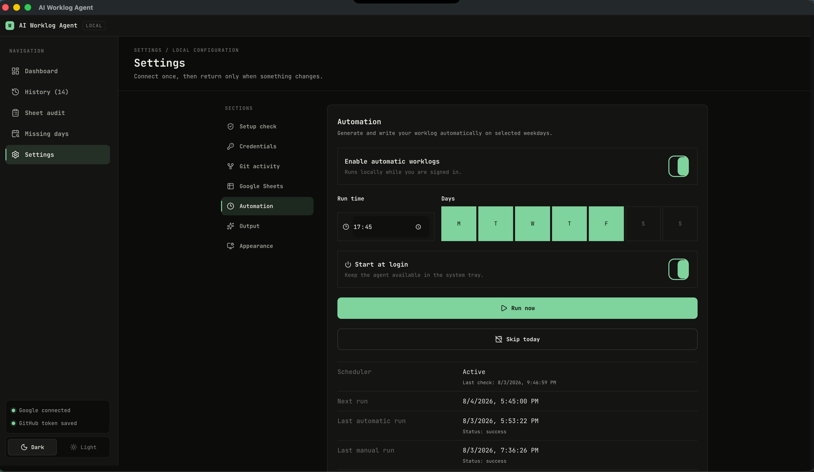

<div align="center">

# AI Worklog Agent

### Your commits, written up as a daily worklog.
### It runs on your machine, on a schedule, and fills in the sheet you would have filled in yourself.

[What it does](#what-it-does) ·
[Local by design](#local-by-design) ·
[Local model](#using-a-local-model) ·
[Install](#macos-installation) ·
[Setup](#one-time-setup) ·
[Daily use](#daily-use) ·
[Automation](#automatic-daily-worklogs)


-informational?style=flat-square)

<br>



</div>

AI Worklog Agent is a local desktop app that reads your GitHub commits and pull
requests, generates a daily work summary with Gemini or a model running on your
own machine, saves local history in SQLite, and can write the result to a
Google Sheet.

Each developer uses their own GitHub token, summary model, GitHub author, and
local settings.

## What it does

- Pulls a day's activity from the GitHub API, or from repositories on your own
  machine using local `git`.
- Counts pull requests you reviewed as well as ones you opened, so a day spent
  on review does not look empty.
- Turns that activity into a short daily summary with Gemini, or with a
  local model so nothing leaves your machine.
- Keeps every generated summary in local history so you can review or redo a
  day.
- Learns your writing style from the summaries you rewrite, so each day sounds
  more like you and less like a model.
- Rolls a week or a month of saved summaries into one update for a standup,
  sprint review, or self-review.
- Optionally upserts the day into a Google Sheet, matching the date in column
  A and writing only the date, summary, and hours columns.
- Can run on a schedule from the tray and catch up on days it missed.

## Local by design

There is no backend server for this project. The app runs a Next.js server
bound to `127.0.0.1` inside an Electron shell. Your tokens, API keys, and
worklog history stay in a SQLite file in your own user data directory, with
secrets encrypted at rest using a key held in the OS keychain. See
[SECURITY.md](SECURITY.md) for the full security model.

## Windows Installation

### Download the installer

1. Open the repository on GitHub.
2. Select **Releases**.
3. Open the newest release.
4. Download the Windows `.exe` under **Assets**.
5. Run the downloaded setup file.

The installer is currently unsigned. Windows SmartScreen may show an
**Unknown publisher** warning. Click **More info**, confirm the file came from
this repository, and choose **Run anyway**.

No Node.js, Git, PowerShell, or `npm` commands are required when using the
installer.

### Developer fallback: install from source

Use this only when an installer artifact is unavailable.

#### 1. Install the prerequisites

Install:

- [Node.js LTS](https://nodejs.org/)
- [Git for Windows](https://git-scm.com/download/win)

Use the default options in both installers.

#### 2. Download and start the app

Open PowerShell and run:

```powershell
git clone https://github.com/shadowmonarchftw-star/worklog-agent.git
cd worklog-agent
npm install
npm run desktop
```

The first start can take a minute. If Windows Firewall asks for permission,
allow Node.js on private networks.

For later starts, open PowerShell in the `worklog-agent` folder and run:

```powershell
npm run desktop
```

## macOS Installation

### Download the installer

1. Open the repository on GitHub.
2. Select **Releases**.
3. Open the newest release.
4. Under **Assets**, download the `arm64` `.dmg` for Apple Silicon or the `x64`
   `.dmg` for Intel.
5. Open the `.dmg` and drag **AI Worklog Agent** into **Applications**.

To identify the Mac type, open **Apple menu > About This Mac**. A Mac showing
**Chip: Apple M1/M2/M3/M4** uses `arm64`. A Mac showing **Processor: Intel**
uses `x64`.

The app uses an ad-hoc signature but is not Apple-notarized. On first launch,
macOS may block it. Control-click the app in **Applications**, select **Open**,
and confirm **Open**. If that option is unavailable, open **System Settings >
Privacy & Security** and select **Open Anyway** for AI Worklog Agent.

If macOS says the app "is damaged and can't be opened," confirm that it came
from this repository, then run:

```bash
xattr -dr com.apple.quarantine "/Applications/AI Worklog Agent.app"
```

Control-click the app and select **Open** again. This command removes the
download quarantine flag from this app only.

No Node.js, Git, Terminal, or `npm` commands are required when using the `.dmg`.

### Developer fallback: install from source

Use this only when a macOS installer artifact is unavailable.

#### 1. Install the prerequisites

Install:

- [Node.js LTS](https://nodejs.org/)
- [Git](https://git-scm.com/download/mac)

#### 2. Download and start the app

Open Terminal and run:

```bash
git clone https://github.com/shadowmonarchftw-star/worklog-agent.git
cd worklog-agent
npm install
npm run desktop
```

For later starts, open Terminal in the `worklog-agent` folder and run:

```bash
npm run desktop
```

## One-Time Setup

Open Settings in the app and provide:

1. **GitHub fine-grained token** - create one in GitHub under Settings,
   Developer settings, Personal access tokens, Fine-grained tokens. Give it
   read access to the repositories and repository metadata you want to use.
2. **Summary model** - either a **Gemini API key** from
   [Google AI Studio](https://aistudio.google.com/app/apikey), or a
   [local model](#using-a-local-model) that keeps your commit messages on your
   own machine.
3. **GitHub commit author** - select your own GitHub username so the app only
   reads your commits from shared repositories.
4. **Repositories** - load and select the repositories used for your worklog.
5. **Summary style** - choose the output format you prefer.

Settings and credentials are stored only in the app's local SQLite database on
that computer. Do not share tokens or commit them to Git.

## Using a Local Model

By default the app sends your activity to Gemini to write the summary. If your
commit messages cannot leave your machine, point it at a local model instead.
Nothing is sent anywhere: the app talks to a server running on your own
computer.

Any OpenAI-compatible server works — [Ollama](https://ollama.com), LM Studio,
llama.cpp, LiteLLM, or vLLM. Using Ollama:

```bash
brew install ollama          # or download from ollama.com
brew services start ollama   # keeps it running after you close the terminal
ollama pull llama3.2:3b
```

Then in **Settings > Credentials**, switch **Summary model** to **Local model**
and set:

| Field | Value |
| --- | --- |
| Server URL | `http://127.0.0.1:11434/v1` |
| Model name | `llama3.2:3b` |
| API key | leave blank — Ollama and LM Studio need none |

Run **Setup check** to confirm the server answers.

### Choosing a model

Under **Settings > Credentials**, click **Load models** to read the list from
your server and pick the name from the field's suggestions. Servers that do not
publish a model list say so; typing the tag by hand still works.

`llama3.2:3b` (2 GB) is the recommended starting point and the practical floor
for this task. Smaller models such as `gemma3:1b` are not usable here: they
ignore the requested style and produce garbled or empty summaries.

Larger models write better. If you have the memory, a 7B or 12B model such as
`gemma3:12b` (8 GB) is a clear step up.

Two things to expect from small local models:

- **Occasional factual drift.** A 3B model may state a version number or detail
  that is not in your activity. Gemini does this less. If a worklog is read by
  other people, spot-check it or use Gemini.
- **A cold first run.** Ollama unloads an idle model after a few minutes, so a
  scheduled run always reloads it first. This is normal and allowed for.

If the local server is not running when an automatic worklog is due, that day
fails with a clear message and is retried. The app never falls back to Gemini
on its own — choosing a local model is treated as a decision about privacy, not
a preference.

## Google Sheets Setup

The person managing the Google Cloud project must complete these steps once:

1. Enable the
   [Google Sheets API](https://console.cloud.google.com/apis/library/sheets.googleapis.com).
2. Configure the OAuth consent screen.
3. While the OAuth app is in Testing mode, add each colleague's Google email
   under **Google Auth Platform > Audience > Test users**.
4. Create an OAuth client and add this authorized redirect URI:

```text
http://127.0.0.1:3000/api/google/callback
```

Each colleague then enters the following in the app's Settings:

- Google Client ID
- Google Client Secret
- Current month's Google Sheet link
- Exact sheet tab name, for example `Sheet1` or `July`
- Default hours

Click **Connect Google**, sign in using a Google account that can edit the
sheet, and approve access.

When the office creates a new sheet next month, replace only the Google Sheet
link and tab name in Settings. Google does not need to be reconnected unless
access was revoked or the OAuth configuration changed.

## Daily Use

1. Open **AI Worklog Agent** from the Windows Start menu. Source-code users run
   `npm run desktop`.
2. Select the work date.
3. Click **Generate Worklog**.
4. Review the generated summary and edit it if needed.
5. Click **Write to Sheet**.

Generating and writing are separate steps, so nothing reaches the sheet until
the summary is reviewed. Automatic daily worklogs still write on their own.

To generate several days at once, turn on the date range option, pick a start
and end date, then review the per-day list before writing. Days that already
have a row in the sheet are unticked by default.

When writing, the app finds the matching date in the date column and updates
that row. If the date does not exist, it adds the date on a new row. The app
only writes the date, generated summary, hours, and — if you map one — a task
reference. Every other column is left untouched.

The default sheet mapping is:

| Column | Value |
| --- | --- |
| A | Date |
| B | Generated task summary |
| C | Not written by the app |
| D | Hours |
| E | Not written by the app |

If your sheet uses a different layout, change the column letters under
**Settings > Google Sheets**. Leave the task reference column empty to keep the
app from writing it at all.

The date in the date column must use `M/D/YYYY`, for example `7/31/2026`. The
sheet can have additional headers, formatting, and formulas. The configured
sheet tab name must exactly match the tab shown at the bottom of Google Sheets.

## Learning Your Writing Style

Edit a generated summary and click away from the box. The app keeps both the
generated text and your rewrite, and feeds your recent rewrites into later
prompts as examples of how you want to sound. Nothing to turn on, and no extra
step — editing is the whole interaction.

A few details worth knowing:

- Only summaries you actually changed count. Leaving one untouched signals
  nothing, so it is not used as an example.
- Examples are matched to the summary style in use. A bullet-point rewrite is
  never used to steer a concise summary.
- The three most recent rewrites are used. Older ones age out on their own.
- Your rewrites guide wording only. The model is told not to reuse their
  content, so yesterday's work never leaks into today's summary.
- Regenerating a day replaces both the summary and your rewrite for that day,
  since the rewrite belonged to the older text.
- Scheduled runs use this too, so automatic worklogs sound the same as the ones
  you write by hand.

For a standing instruction that applies to every summary — mentioning ticket
numbers, say — use **Settings > Output > Summary preferences** instead. Rewrites teach
voice; the preference states a rule.

## Weekly and Monthly Rollups

Open **History**, pick **Week** or **Month**, choose any date inside the period,
and click **Generate rollup**. The app combines the daily summaries it already
saved for that period into one update, then offers it for copying.

- A week runs Monday to Sunday. A month runs from the first to the last day.
- Days with no recorded work are skipped, not guessed at.
- Where you rewrote a day by hand, the rollup uses your version.
- Rollups use the same model you picked for daily summaries, so a local model
  keeps the work on your machine here too.
- A rollup is not saved to history and is never written to the sheet. It covers
  a period rather than a dated row, and the sheet is one row per day.

Because the rollup is built from summaries the app already has, it costs one
model call regardless of how long the period is, and it works offline with a
local model.

## Pull Request Activity

Alongside commits, the app searches GitHub for pull requests you opened and
pull requests you reviewed on the selected date, and labels them separately in
the summary. A day with no commits but a morning of review still produces a
worklog instead of being recorded as a day with no activity.

Both searches are limited to the repositories you selected, so review work in
repositories you did not pick is left out. A PR you both opened and reviewed is
counted once, as your own. If GitHub rate-limits the review search, the day
still uses the pull requests you opened rather than failing.

## Filtering Noisy Commits

Open **Settings > Git activity** and add comma-separated words under commit
exclusions, for example `merge, chore, bump`. Any commit whose message contains
one of those words is left out of the worklog. Matching ignores capitalisation.

Each selected repository also has its own filter box for exclusions that should
only apply to that repository. Both lists are combined.

## Setup Check

**Settings > Setup Check** verifies the whole chain in one click: GitHub token
or local repositories, Gemini, Google Sheets access, sheet headers, and whether
saved credentials can still be decrypted. Run it after changing any setting.

If the credential check fails, the app's credential key changed or was lost —
re-enter the affected tokens in Settings.

## Automatic Daily Worklogs

After GitHub, Gemini, and Google Sheets are connected:

1. Open **Settings > Automation**.
2. Choose the run time and weekdays. The default is Monday-Friday at 17:30.
3. Enable **Automatic worklogs**.
4. Leave **Start at login** enabled so the agent stays available in the system
   tray.
5. Click **Run now** once to verify the complete setup.

At the scheduled local time, the app reads that day's GitHub activity,
generates the summary, updates the matching Google Sheet date row, stores local
history, and shows a desktop notification. Closing the window keeps the agent
in the tray while automation is enabled.

The computer must be powered on and the user must be signed in. If it was
asleep at the scheduled time, the agent performs one same-day catch-up after
waking. A successful day or a day with no GitHub activity is not repeated
automatically.

## Using Local Commits

The desktop app can generate worklogs from commits on your computer without
reading GitHub:

1. Install Git and make sure the `git` command is available.
2. Open **Settings > Git activity**.
3. Select **Local repositories**.
4. Click **Add repository** and choose each repository folder.
5. Confirm the detected Git name and email. Add alternate author emails only
   when older commits used another account.

Local mode reads completed commits from every local branch, including commits
that have not been pushed. It ignores staged, unstaged, and untracked changes.
Each repository uses its own Git identity, so company and personal accounts can
be included safely in the same worklog.

GitHub mode reads commits returned for each repository's default branch. Use
local mode when the worklog must include commits from several branches before
they are merged into the default branch.

## Local Data

Settings, credentials, Google tokens, and summary history are stored locally:

Windows:

```text
%APPDATA%\AI Worklog Agent\worklog.sqlite
```

macOS:

```text
~/Library/Application Support/AI Worklog Agent/worklog.sqlite
```

Deleting this database resets the app and removes its locally saved settings.

Tokens and API keys inside the database are encrypted with a per-machine
credential key stored beside it as `credential-key`. Deleting that file without
deleting the database makes the saved credentials unreadable — Setup Check will
report this, and re-entering them in Settings fixes it.

## Troubleshooting

### Google says "Access blocked"

The Google OAuth app is in Testing mode. Add the colleague's Google email under
**Google Auth Platform > Audience > Test users**, wait a minute, and connect
again.

### Google Sheets API returns `403 SERVICE_DISABLED`

Enable the Google Sheets API in the same Google Cloud project used by the OAuth
client. Wait a few minutes, then generate the worklog again.

### Google sign-in or passkey verification is stuck

Close the old sign-in window, restart the desktop app, and reconnect. Google
sign-in opens in the system browser so passkeys can work normally.

### PowerShell cannot find `npm` or `git`

Close and reopen PowerShell after installing Node.js or Git. If the command is
still unavailable, restart Windows and try again.

### Windows shows a blank app window

Uninstall the current version, then install the newest
`AI-Worklog-Agent-Windows` artifact from Releases.

## Development Commands

Run the web interface:

```bash
npm run dev
```

Run the Electron desktop app:

```bash
npm run desktop
```

Run tests:

```bash
npm test
```

Create a production Next.js build:

```bash
npm run build
```

Build the Windows installer on a Windows computer:

```powershell
npm run dist:win
```

The installer is written to the `release` folder.

Build a macOS `.dmg` on a Mac:

```bash
npm run dist:mac
```

## Creating a Windows Installer on GitHub

Repository maintainers can create a new installer without a Windows computer:

1. Open the repository on GitHub.
2. Select **Actions**.
3. Select **Build Windows Installer**.
4. Click **Run workflow** and choose the `master` branch.
5. Wait for the workflow to finish.
6. Open the completed run and download `AI-Worklog-Agent-Windows` under
   **Artifacts**.

These manual runs are for testing. Pushing a version tag such as `v0.3.2`
starts the combined release workflow and permanently publishes every installer
on the repository's **Releases** page.

## Creating macOS Installers on GitHub

1. Open the repository on GitHub.
2. Select **Actions**.
3. Select **Build macOS Installers**.
4. Click **Run workflow** and choose the `master` branch.
5. Wait for both Apple Silicon and Intel jobs to finish.
6. Download both macOS artifacts and share the one matching the colleague's
   Mac.

Pushing a version tag publishes both macOS installers and the Windows installer
on one GitHub Release after every platform build succeeds.
